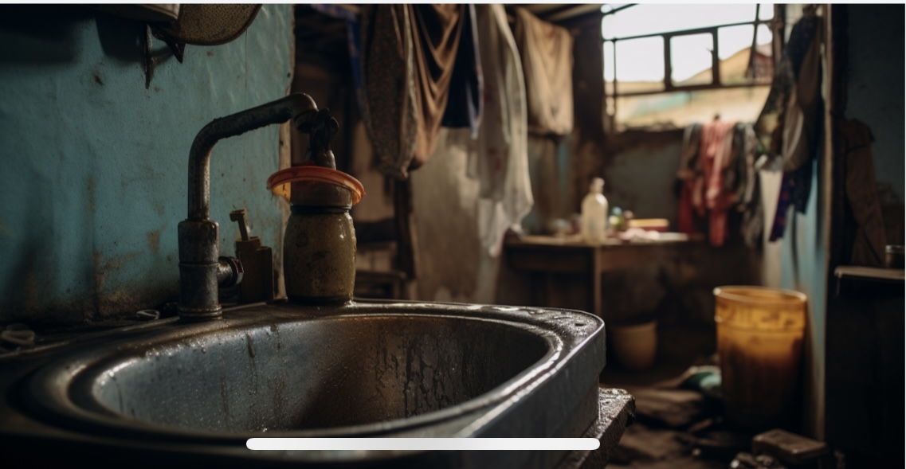

# Clustering-data-to-unveil-Maji-Ndogo-s-water-crisis

This project is about using data to understand and solve water-related problems in Maji Ndogo. By organizing and analyzing the information, we can identify patterns and trends, such as areas with the most water challenges. The goal is to take this knowledge and turn it into practical steps to make clean water more available and accessible to everyone in the community.

## Project Overview

The analysis is centered on:

- Identify patterns in water source usage and quality.
- Identifying infrastructure needs for various water source types
- Tracking employee data to assess improvement efforts
- Generating recommendations for improvement (e.g., installing filters, diagnosing infrastructure issues, etc.)
- Highlight pollution issues and propose corrections

## Key Tasks:
- Understand the Data: Analyze foundational tables like water sources, visits, and quality metrics.
- Explore Visit Patterns: Identify frequently visited locations, long queue times, and possible inefficiencies.
- Assess Water Quality: Filter high-visit, poor-quality sources and flag errors in cleanliness reports.
- Investigate Pollution: Correct inconsistencies in pollution data using SQL and validate results.

## Insights and Recommendations

- Water source distribution and usage patterns.
- Locations with the longest queues or highest contamination.
- Areas requiring immediate intervention based on pollution.

## Database Structure

The project uses the following tables:

- **`visits`**: Contains information on visits to each water source, including queue times and assigned employees.
- **`well_pollution`**: Tracks pollution results for well water sources.
- **`water_source`**: Stores metadata on each water source, including type and population served.
- **`location`**: Stores location-specific information, including town, province, and address.
- **`Project_progress`**: Tracks improvement projects for each source, including status and comments.

## Key Features

1. **Project Tracking**: Automatically updates improvement recommendations based on water quality results and queue times.
2. **Employee Performance**: Monitors employee performance by tracking discrepancies between auditor and surveyor assessments.
3. **Infrastructure Recommendations**: Generates specific infrastructure improvement actions based on data (e.g., installing additional taps for long queues).

## How to Run the Project

1. Import the SQL files provided in the `/sql` directory.
2. Populate the database with sample data, following the instructions in `data_loading.sql`.
3. Execute the query files to generate views, track progress, and analyze data.

## Access the Full Documentation

Dataset was provided by ALX [project documentation](https://alx.com).
